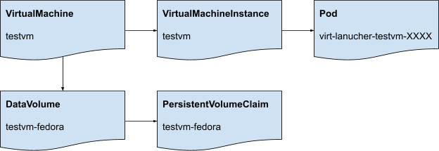

# Backing Up and Restoring KubeVirt resources

## Introduction

This document is intended for developers building backup/disaster recovery solutions for KubeVirt.

Such solutions typically perform the following high level operations.

### Backup

1.  Build dependency graph for all required Kubernetes resources
2.  Quiesce (freeze) applications
3.  Snapshot PersistentVolumeClaim data
4.  Unquiesce (thaw) applications
5.  Copy all necessary Kubernetes resource definitions to a shared storage location
6.  (optional) Export snapshotted PVC data to a shared storage location

Steps 3, 5, and 6 are beyond the scope of this document.

### Restore

1.  Populate PersistentVolumeClaims with snapshot data
2.  Sanitize and apply all relevant Kubernetes resource definitions

Step 1 is beyond the scope of this document.

## Existing KubeVirt Backup Solutions

### Velero Plugin

[Velero](https://velero.io/) is a popular tool for backing up/migrating Kubernetes clusters.  The KubeVirt team actively maintains a [plugin](https://github.com/kubevirt/kubevirt-velero-plugin) for use with Velero.  The plugin implements much of the logic described in this document.

### VirtualMachineSnapshot + VirtualMachineExport API

The [VirtualMachineSnapshot API](https://kubevirt.io/user-guide/operations/snapshot_restore_api/) provides an easy way for KubeVirt users to backup VirtualMachines within a cluster.  On its own, it is not suitable for offsite backup or disaster recovery.  But combined with the [VirtualMachineExport API](https://kubevirt.io/user-guide/operations/export_api/), VirtualMachine volumes may be made available for copy to remote locations.

## Building the KubeVirt Object Graph



In this section, KubeVirt resources and their relationships will be explored by showing how yaml snippets map to nodes in an object graph.

Nodes in the object graph are represented by the following tuple:

(APIGroup, Kind, namespace, name)

### VirtualMachine Object Graph

```yaml
apiVersion: kubevirt.io/v1
kind: VirtualMachine
metadata:
  name: vm1
  namespace: ns1
...
```

- ("kubevirt.io", "VirtualMachine", "ns1", "vm1")

#### spec.instancetype

```yaml
...
spec:
  instancetype:
    kind: VirtualMachineInstancetype
    name: small
...
```

- ("kubevirt.io", "VirtualMachineInstancetype", "ns1", "small")

```yaml
...
spec:
  instancetype:
    kind: VirtualMachineClusterInstancetype
    name: csmall
...
```

- ("kubevirt.io", "VirtualMachineClusterInstancetype", "", "csmall")

#### spec.preference

```yaml
...
spec:
  preference:
    kind: VirtualMachinePreference
    name: windows
...
```

- ("kubevirt.io", "VirtualMachineClusterPreference", "ns1", "windows")

```yaml
...
spec:
  preference:
    kind: VirtualMachineClusterPreference
    name: cwindows
...
```

- ("kubevirt.io", "VirtualMachineClusterPreference", "", "cwindows")

#### spec.template

See [VirtualMachineInstance](#virtualmachineinstance-object-graph)

### VirtualMachineInstance Object Graph

```yaml
apiVersion: kubevirt.io/v1
kind: VirtualMachineInstance
metadata:
  name: vmi1
  namespace: ns1
...
```

- ("kubevirt.io", "VirtualMachineInstance", "ns1", "vmi1")
- ("", "Pod", "ns1", "virt-launcher-vmi1-XXXXX") \*

\* Each VirtualMachineInstance has a corresponding uniquely named Pod.  The backup process can look up the name of this pod by using the `kubevirt.io/created-by=<UID of VirtualMachineInstance>` label selector.

#### spec.priorityClassName

```yaml
...
spec:
  priorityClassName: pc1
...
```

- ("scheduling.k8s.io", "PriorityClass", "", "pc1")

#### spec.volumes[\*].persistentVolumeClaim

```yaml
...
spec:
  volumes:
  - name: v1
    persistentVolumeClaim:
      claimName: pvc1
...
```

- ("", "PersistentVolumeClaim", "ns1", "pvc1")
- ("cdi.kubevirt.io", "DataVolume", "ns1", "pvc1")

#### spec.volumes[\*].dataVolume

```yaml
...
spec:
  volumes:
  - name: v1
    dataVolume:
      name: dv1
...
```

- ("", "PersistentVolumeClaim", "ns1", "dv1")
- ("cdi.kubevirt.io", "DataVolume", "ns1", "dv1")

#### spec.volumes[\*].configMap

```yaml
...
spec:
  volumes:
  - name: v1
    configMap:
      name: cm1
...
```

- ("", "ConfigMap", "ns1", "cm1")

#### spec.volumes[\*].secret

```yaml
...
spec:
  volumes:
  - name: v1
    secret:
      name: s1
...
```

- ("", "Secret", "ns1", "s1")

#### spec.volumes[\*].serviceAccount

```yaml
...
spec:
  volumes:
  - name: v1
    serviceAccount:
      serviceAccountName: sa1
...
```

- ("", "ServiceAccount", "ns1", "sa1")

#### spec.volumes[\*].memoryDump

```yaml
...
spec:
  volumes:
  - name: v1
    memoryDump:
      claimName: pvc1
...
```

- ("", "PersistentVolumeClaim", "ns1", "pvc1")

#### spec.networks[\*].multus

```yaml
...
spec:
  networks:
  - name: ovs-net
    multus:
      networkName: ovs-vlan-100
...
```

- ("k8s.cni.cncf.io", "NetworkAttachmentDefinition", "ns1", "ovs-vlan-100")

#### spec.accessCredentials[\*].sshPublicKey

```yaml
...
spec:
  accessCredentials:
  - sshPublicKey:
      source:
        secret:
          secretName: my-pub-key
...
```

- ("", "Secret", "ns1", "my-pub-key")

#### spec.accessCredentials[\*].userPassword

```yaml
...
spec:
  accessCredentials:
  - userPassword:
      source:
        secret:
          secretName: my-user-password
...
```

- ("", "Secret", "ns1", "my-user-password")

### VirtualMachineInstanceReplicaSet Object Graph

```yaml
apiVersion: kubevirt.io/v1
kind: VirtualMachineInstanceReplicaSet
metadata:
  name: vmirs1
  namespace: ns1
...
```

- ("kubevirt.io", "VirtualMachineInstanceReplicaSet", "ns1", "vmirs1")
- ("kubevirt.io", "VirtualMachineInstance", "ns1", "vmirs1XXXX1") \*
- ("kubevirt.io", "VirtualMachineInstance", "ns1", "vmirs1XXXX2") \*

\* there are usually multiple VirtualMachineInstances corresponding to a VirtualMachineInstanceReplicaSet.  The backup process can look up the name of this pod by using the `kubevirt.io/vmReplicaSet=<name of VirtualMachineInstanceReplicaSet>` label selector.

#### spec.template

See [VirtualMachineInstance](#virtualmachineinstance-object-graph)

## Backup Actions

### Guest filesystem freeze/thaw hooks

See [this guide](https://github.com/kubevirt/kubevirt/blob/main/docs/freeze.md) for how to execute the freeze/thaw hooks for each VirtualMachineInstance encountered in the object graph.

## Restore Actions

### VirtualMachine Restore

If restoring to a different cluster, and mac address or bios serial number are explicitly set, you should make sure there will be no collisions.  These values are set in:

```
/spec/template/spec/domain/devices/interfaces/<index>/macAddress
/spec/template/spec/domain/firmware/serial
```

### VirtualMachineInstance Restore

If a VirtualMachineInstance is **owned by a VirtualMachine**, it should **not be restored**.  The KubeVirt controller will recreate the resource based on the VirtualMachine definition.  Otherwise, VirtualMachineInstance definitions may be backed up/restored with the same precautions as VirtualMachine for mac address/bios.

```
/spec/domain/devices/interfaces/<index>/macAddress
/spec/domain/firmware/serial
```

### virt-launcher Pod Restore

A Pod with “virt-launcher-” prefix that is ***owned by a VirtualMachineInstance** should not be restored.

### DataVolume Restore

DataVolumes in **Succeeded phase** (status.phase) should have the following **annotation added** at restore time.  Otherwise, the associated PersistentVolumeClaim may get corrupted.  DataVolumes in any phase other than Succeeded do not need to be annotated.

```yaml
cdi.kubevirt.io/storage.prePopulated: <datavolume name>
```

### PersistentVolumeClaim Restore

PersistentVolumeClaims ***owned by DataVolumes*** must have the following ***annotation added*** at backup/restore time.

```yaml
cdi.kubevirt.io/storage.populatedFor: <datavolume name>
```
